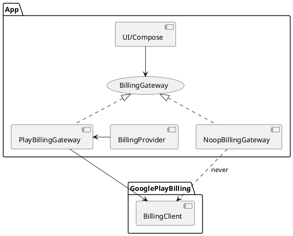

Lumo Neutered-Fork (Run Without Google Play Services)

```
android-lumo-neutered
```

## Background

Lumo is the privacy-first AI assistant created by Proton, the team behind encrypted email, VPN, password manager, and cloud storage trusted by over 100 million people. 

This is a fork of a native Android application wrapper for the Lumo web application with additional features. voice entry.

Upstream Repository:
[https://github.com/ProtonLumo](https://github.com/ProtonLumo)


**Clarification:** 

I'm not a Lumo developer; it was created by Proton AG.  

However, regarding the privacy-focused philosophy we seek, it becomes contradictory when Lumo refuses to run not only on GMS-free devices but even on devices where GMS exists but is not logged in. This is especially puzzling as a long-time paid subscriber of Proton and highly support an encrypted, privacy-first LLM application as part of their suite.

Many users, myself included, still have GMS installed and are not rooted. We simply refuse to log in or use DNS filters/firewalls to block Google. We are not completely against it; we just prefer not to use it on devices that prioritize privacy.  

Therefore, the goal can simply be to create a fork that works without Play Store restrictions—no need to log in. Further developments rely on the Proton team and FLOSS community.


## Scope

**Goal.** This fork focuses on making the Lumo Android app fully usable **without a Google account or services** on the device (“neuterized Lumo 🐈‍⬛”) by providing a build that runs correctly on devices **with or without Google Play Services** while preserving core functionality and keeping Play Services/Billing present but strictly optional at runtime.

**Acknowledgements.** Respect to the original authors. This fork’s goal is simple: **make it usable** without tying core features to a Google account.

**Expected Runtime Behavior.** Detect Play Services / Billing. If Play Services or a signed-in account is missing, hide or disable the purchase UI. Purchase flows should gracefully disable while the app keeps working (no crash). 

**What the current codebase uses from Google.**

- **Play Billing only.** The app depends on **`com.android.billingclient:billing-ktx`** via the Gradle Version Catalog alias `libs.billing.ktx` (declared in `android-lumo-main/gradle/libs.versions.toml`; referenced in `app/build.gradle.kts`).
- **GMS check.** There are imports of `com.google.android.gms.common.*` (e.g., `GoogleApiAvailability`, `ConnectionResult`) used to check GMS availability in `BillingManagerWrapper.kt`.
- **No Firebase/Maps/ML Kit/Play Core.** The scan did **not** surface Firebase, Google Maps, ML Kit, or Play Core usages.
- **Payment UI present.** There are Kotlin files for a payment flow (`PaymentDialog`, `PaymentProcessingScreen`, models like `Payment`, `InAppGooglePayload`), suggesting an existing UX that could support a non‑Play (web or server-side) purchase path.

**Implication.** The blocking dependency for GMS-free operation is the **Google Play Billing** integration and the hard GMS check. Everything else appears portable.

**High-level path forward (to be validated).**
1. **Introduce flavors**: `play` (with Play Billing) and `foss` (no Play Billing, no GMS).
2. **Abstract billing behind an interface** with two implementations:
   - `PlayBillingManager` (current code) — compiled only in the `play` flavor.
   - `NoopOrAltBillingManager` — compiled in the `foss` flavor; either disables purchases or routes to an alternative (e.g., web checkout + server validation).
3. **Remove runtime GMS coupling** by replacing `GoogleApiAvailability` checks with **BillingClient result handling** (for `play` flavor) and feature flags for the `foss` flavor.
4. **Gate UI**: hide/replace “Upgrade/Purchase” flows when `BILLING_ENABLED=false` (foss), or show an alternative purchase path if desired.
5. **Ship a feature-complete free build** (no IAP) on non-Play channels *or* to add a **non‑Play purchase alternative** (e.g., web checkout with server unlock).
- Future Distribution targets include at least one **non‑Play channel** (e.g., F-Droid or direct APK).

This fork focuses on **making the app fully usable without a Google account** on
 the device (“neuterized Lumo 🐈‍⬛”). It keeps Play Services/Billing present but
 **strictly optional at runtime**. If Play Services or a signed Play account is
 absent, purchase flows gracefully disable while all non-purchase features keep
 working.


## Requirements

**Must**
- Run on devices **without Google Play Services** or with GMS present but **not signed in** (no crashes, no blockers).
- Provide **two build flavors**: `play` (current behavior) and `foss` (no GMS/Play Billing). Both must produce signed release builds.
- Remove hard runtime coupling to `GoogleApiAvailability` and **compile-time dependency** on `com.android.billingclient:billing-ktx` in the `foss` flavor.
- **No Google login required**; the app must not require Play Store to open or use core features.
- Keep **Proton account sign-in** and existing app functionality otherwise unchanged.
- Hide/disable purchase entry points when billing is unavailable (feature-flagged).
- No `google-services.json`, no `com.google.gms.google-services` Gradle plugin in `foss`.

**Should**
- Show a clear **“Billing not available on this build”** state instead of errors.
- Allow operation under **DNS filter / firewall** that blocks Google hosts.
- Use **WebView-only** system components; do not rely on Play Core / Play Asset Delivery.
- Keep privacy posture: **no analytics/telemetry** added in `foss`.

**Could**
- Optional **alternative purchase path** (external web checkout) gated behind a setting, if acceptable later.
- Add **CI pipeline** jobs to build & sign `fossRelease` and publish to F-Droid or direct APK.

**Won’t (MVP)**
- No Play Billing in `foss`.
- No Google Sign-In, SafetyNet, or Play Integrity requirements in `foss`.
- No attempt to emulate Google Billing locally.


## Method

### Design Summary
- Keep a **single app flavor** for now, but make billing **lazy, optional, and fail‑safe**.
- **Remove GMS runtime checks** (`GoogleApiAvailability/ConnectionResult`), and rely on **BillingClient connection results** and timeouts.
- **Gate the Upgrade UI** with a runtime flag and the billing readiness state.
- Introduce a tiny **Billing facade** with a **No‑op fallback** created automatically if billing cannot initialize.

### Components
- `BillingGateway` (interface): minimal surface used by UI/VM layer.
- `PlayBillingGateway` (refactor of current `BillingManager`) — only used when connection succeeds.
- `NoopBillingGateway` — returns `available=false` and throws no errors (used by default on GMS-free / not-signed-in / blocked DNS devices).
- `BillingProvider` — factory that builds `PlayBillingGateway` or `NoopBillingGateway` with a **2s connect timeout**.

### Key Behaviors
1. **App startup**: Do **not** connect to Billing. Nothing Google-related runs at cold start.
2. **User taps Upgrade**: `BillingProvider` attempts a connection; on any failure (timeout / `SERVICE_UNAVAILABLE` / `BILLING_UNAVAILABLE` / `DEVELOPER_ERROR`) it returns `NoopBillingGateway`, the UI shows a friendly "Purchases unavailable" screen, and the app continues normally.
3. **DNS/Firewall**: timeouts prevent hangs; all exceptions are caught and mapped to `available=false`.
4. **No GMS imports**: delete `GoogleApiAvailability/ConnectionResult` imports and code paths.

### Minimal Interfaces (proposed)
```kotlin
// BillingProvider.kt (MVP: optional billing; safe fallback)
object BillingProvider {
    suspend fun get(activity: MainActivity?): BillingGateway = withContext(Dispatchers.IO) {
        return@withContext runCatching {
            withTimeout(2000) {
                val manager = BillingManager(
                    activity = activity ?: error("Activity required for billing"),
                    billingCallbacks = /* your existing callbacks provider */
                        (activity as? HasBillingCallbacks)?.billingCallbacks()
                            ?: error("Callbacks required")
                )
                val gateway = PlayBillingGateway(manager)
                if (gateway.available) gateway else NoopBillingGateway()
            }
        }.getOrElse { NoopBillingGateway() }
    }
}
```

> `PlayBillingGateway.available` is `true` only after `BillingClient.startConnection` returns `OK`.

### Remove GMS Coupling (example)
- In `BillingManagerWrapper.kt`: delete
```kotlin
// BillingProvider.kt (MVP: optional billing; safe fallback)
object BillingProvider {
    suspend fun get(activity: MainActivity?): BillingGateway = withContext(Dispatchers.IO) {
        return@withContext runCatching {
            withTimeout(2000) {
                val manager = BillingManager(
                    activity = activity ?: error("Activity required for billing"),
                    billingCallbacks = /* your existing callbacks provider */
                        (activity as? HasBillingCallbacks)?.billingCallbacks()
                            ?: error("Callbacks required")
                )
                val gateway = PlayBillingGateway(manager)
                if (gateway.available) gateway else NoopBillingGateway()
            }
        }.getOrElse { NoopBillingGateway() }
    }
}
```

### PlantUML – Component View


### Gradle/Packaging Notes
- Keep `com.android.billingclient:billing-ktx` for now (single flavor). This **does not require** the user to be logged into Play; it’s safe if you never launch it.
- Ensure **no** `com.google.android.gms:play-services-*` artifacts are in dependencies.
- For a future F-Droid build, we can introduce a `foss` flavor that **omits** the billing dependency and compiles only `NoopBillingGateway`.


## Implementation

### 0) Summary
Make billing *optional* at runtime. If Play Billing cannot initialize quickly (no Play login, GMS blocked, DNS filters, etc.), we fall back to a **No‑op** billing gateway and keep the rest of the app fully functional. No flavor split is required for the MVP.

---

### 1) Add a tiny billing facade
**New file** `app/src/main/java/me/proton/android/lumo/billing/gateway/BillingGateway.kt`
```kotlin
// BillingProvider.kt (MVP: optional billing; safe fallback)
object BillingProvider {
    suspend fun get(activity: MainActivity?): BillingGateway = withContext(Dispatchers.IO) {
        return@withContext runCatching {
            withTimeout(2000) {
                val manager = BillingManager(
                    activity = activity ?: error("Activity required for billing"),
                    billingCallbacks = /* your existing callbacks provider */
                        (activity as? HasBillingCallbacks)?.billingCallbacks()
                            ?: error("Callbacks required")
                )
                val gateway = PlayBillingGateway(manager)
                if (gateway.available) gateway else NoopBillingGateway()
            }
        }.getOrElse { NoopBillingGateway() }
    }
}
```kotlin
package me.proton.android.lumo.billing.gateway

import android.content.Context
import kotlinx.coroutines.Dispatchers
import kotlinx.coroutines.withContext
import kotlinx.coroutines.withTimeout
import me.proton.android.lumo.billing.BillingManager

private const val BILLING_CONNECT_TIMEOUT_MS = 2000L

object BillingProvider {
    /**
     * Attempts to initialize Play Billing quickly; on any error or timeout, returns Noop.
     */
    suspend fun get(context: Context): BillingGateway = withContext(Dispatchers.IO) {
        return@withContext try {
            withTimeout(BILLING_CONNECT_TIMEOUT_MS) {
                val bm = BillingManager(context)
                // perform a lightweight readiness call if available in BillingManager
                if (bm.isBillingAvailable()) PlayBillingGateway(bm) else NoopBillingGateway()
            }
        } catch (_: Throwable) {
            NoopBillingGateway()
        }
    }
}
```kotlin
// BillingProvider.kt (MVP: optional billing; safe fallback)
object BillingProvider {
    suspend fun get(activity: MainActivity?): BillingGateway = withContext(Dispatchers.IO) {
        return@withContext runCatching {
            withTimeout(2000) {
                val manager = BillingManager(
                    activity = activity ?: error("Activity required for billing"),
                    billingCallbacks = /* your existing callbacks provider */
                        (activity as? HasBillingCallbacks)?.billingCallbacks()
                            ?: error("Callbacks required")
                )
                val gateway = PlayBillingGateway(manager)
                if (gateway.available) gateway else NoopBillingGateway()
            }
        }.getOrElse { NoopBillingGateway() }
    }
}
```

- **Initialize lazily via provider** (inside your existing init path or when user opens upgrade):
```kotlin
// BillingProvider.kt (MVP: optional billing; safe fallback)
object BillingProvider {
    suspend fun get(activity: MainActivity?): BillingGateway = withContext(Dispatchers.IO) {
        return@withContext runCatching {
            withTimeout(2000) {
                val manager = BillingManager(
                    activity = activity ?: error("Activity required for billing"),
                    billingCallbacks = /* your existing callbacks provider */
                        (activity as? HasBillingCallbacks)?.billingCallbacks()
                            ?: error("Callbacks required")
                )
                val gateway = PlayBillingGateway(manager)
                if (gateway.available) gateway else NoopBillingGateway()
            }
        }.getOrElse { NoopBillingGateway() }
    }
}
```

- **Use `billing.available` for UI/state** instead of GMS checks:
```kotlin
// BillingProvider.kt (MVP: optional billing; safe fallback)
object BillingProvider {
    suspend fun get(activity: MainActivity?): BillingGateway = withContext(Dispatchers.IO) {
        return@withContext runCatching {
            withTimeout(2000) {
                val manager = BillingManager(
                    activity = activity ?: error("Activity required for billing"),
                    billingCallbacks = /* your existing callbacks provider */
                        (activity as? HasBillingCallbacks)?.billingCallbacks()
                            ?: error("Callbacks required")
                )
                val gateway = PlayBillingGateway(manager)
                if (gateway.available) gateway else NoopBillingGateway()
            }
        }.getOrElse { NoopBillingGateway() }
    }
}
```

**Optional**: Add a small, non-blocking banner in Settings: _“Google Play Billing not available. App remains fully functional.”_

---

### 4) Gradle review (no change needed for MVP)
- Keep `implementation(libs.billing.ktx)` (already present). Merely **not launching** billing on devices without Play login is sufficient for stability.
- Ensure there is **no** `com.google.android.gms:play-services-*` dependency. Our scan found none.

---

### 5) Logging & error hygiene
- Wrap all billing calls with `runCatching { … }` and log **debug** only (avoid leaking PII).
- Map all exceptions/timeouts to `available=false`.

---

### 6) Smoke checklist
- Device **without** GMS: app starts, no crash, upgrade UI shows disabled state.
- Device **with** GMS but **not signed in**: same as above.
- Device with GMS **and** Play login: upgrade UI allows purchase (unchanged behavior).
- Device with DNS firewall blocking Google: no hangs; 2s timeout path engaged; UI disabled gracefully.

---

### 7) (Future) F-Droid-ready variant (optional)
Later, add a `foss` flavor that **omits** `billing-ktx` and only compiles the `NoopBillingGateway`. This ensures a fully GMS-free artifact for F-Droid while keeping the single-flavor MVP simple today.


## Milestones

**M1 — Repo & Build Sanity **
- Tasks: Set up branch, enable CI job for `assembleRelease`, turn on strict warnings for billing module.
- Deliverables: Green CI build artifact, baseline logs captured.
- Acceptance: App launches on a device **without Play login** and does not crash at startup.

**M2 — Billing Facade & No‑op **
- Tasks: Add `BillingGateway`, `NoopBillingGateway`, `PlayBillingGateway`, `BillingProvider` with 2s timeout.
- Deliverables: Compiles; unit tests for provider timeout/exception paths.
- Acceptance: Provider returns `Noop` when Play Billing can’t initialize.

**M3 — Remove GMS Coupling **
- Tasks: Delete `GoogleApiAvailability/ConnectionResult` imports & code paths; switch to provider.
- Deliverables: Diff reviewed; no direct GMS checks remain.
- Acceptance: Static scan shows **0** references to `com.google.android.gms.common`.

**M4 — UI Gating **
- Tasks: Gate purchase UI on `billing.available`; add friendly disabled state copy.
- Deliverables: Compose preview screenshots for enabled/disabled states.
- Acceptance: On devices w/o Play login or with Google blocked, Upgrade UI shows disabled state with no errors.

**M5 — Error/Log Hygiene **
- Tasks: Wrap billing calls in `runCatching`; reduce logs to debug; ensure no PII; add lightweight analytics toggle = **off**.
- Deliverables: Log samples under failure scenarios.
- Acceptance: No stacktraces surfaced to users; errors map to clean UI state.

**M6 — Test Matrix **
- Tasks: Verify on 4 scenarios: (a) no GMS, (b) GMS installed not signed in, (c) GMS signed in, (d) DNS blocks Google.
- Deliverables: Test report with screenshots/video clips.
- Acceptance: a/b/d → `Noop` path; c → purchases work unchanged.

**M7 — Packaging & Pilot **
- Tasks: Produce signed APK; tag release; write short release notes highlighting Play‑free operation.
- Deliverables: `Lumo-Play-Optional.apk` for testers.
- Acceptance: Pilot users confirm normal app usage without Play login.

**(Optional) M8 — F-Droid Variant **
- Tasks: Introduce `foss` flavor; remove `billing-ktx` from that flavor; compile only `Noop`.
- Acceptance: The F-Droid build has **no** Google artifacts and passes lint/static scans (it won't avoid the anti-features flag on network dependency).


## Gathering Results

### Success Criteria (no tracking required)
- **SC1. Startup stability**: 0 crashes at app launch on devices (a) no GMS, (b) GMS installed but not signed in, (c) GMS signed in, (d) Google hosts blocked.
- **SC2. UX behavior**: Upgrade/Purchase UI shows **disabled** state when billing is unavailable; no blocking dialogs or toasts.
- **SC3. Core features**: All non-purchase features function identically across all four scenarios.
- **SC4. Performance**: Billing init attempt never blocks UI > 2s; mean fallback < 500ms on DNS-blocked devices.

### How to Measure (privacy-friendly)
- **Automated tests**
  - Instrumented tests to assert `BillingProvider.get()` returns `NoopBillingGateway` when Play Billing handshake fails (mock network/GMS).
  - UI tests verifying disabled-state components are shown when `available=false`.
- **Manual matrix** (QA sheet)
  - 4-device (or 4-profile) matrix: (a) no GMS, (b) GMS not signed in, (c) GMS signed in, (d) DNS blocked.
  - Record: launch result, upgrade screen state, core flows sanity.
- **Opt‑in diagnostics (local only)**
  - Add a Settings toggle **“Include diagnostics in feedback”**. When enabled, export a sanitized text file containing: app version, Android version, `BillingProvider` outcome (Noop/Play), and timing (ms). No identifiers.
  - Provide a **Share Logs** button that opens the system share sheet with the sanitized file.

### Logcat/CLI Snippets
- Filter billing events during QA:
  ```bash
  adb logcat | grep -E "BillingProvider|PlayBillingGateway|NoopBillingGateway"
  ```kotlin
// BillingProvider.kt (MVP: optional billing; safe fallback)
object BillingProvider {
    suspend fun get(activity: MainActivity?): BillingGateway = withContext(Dispatchers.IO) {
        return@withContext runCatching {
            withTimeout(2000) {
                val manager = BillingManager(
                    activity = activity ?: error("Activity required for billing"),
                    billingCallbacks = /* existing callbacks provider */
                        (activity as? HasBillingCallbacks)?.billingCallbacks()
                            ?: error("Callbacks required")
                )
                val gateway = PlayBillingGateway(manager)
                if (gateway.available) gateway else NoopBillingGateway()
            }
        }.getOrElse { NoopBillingGateway() }
    }
}
```yaml
  Categories:
    - Internet
    - Productivity
  License: <match upstream>
  SourceCode: https://github.com/<fork>/lumo
  IssueTracker: https://github.com/<fork>/lumo/issues
  AutoName: Lumo (Play‑Optional)
  RepoType: git
  Repo: https://github.com/<fork>/lumo.git
  Builds:
    - versionName: 1.0.0-neutered
      versionCode: 100
      commit: <tag-or-commit>
      subdir: android-lumo-main/app
      gradle:
        - yes
      output: app/build/outputs/apk/release/app-release.apk
  ```kotlin
// BillingProvider.kt (MVP: optional billing; safe fallback)
object BillingProvider {
    suspend fun get(activity: MainActivity?): BillingGateway = withContext(Dispatchers.IO) {
        return@withContext runCatching {
            withTimeout(2000) {
                val manager = BillingManager(
                    activity = activity ?: error("Activity required for billing"),
                    billingCallbacks = /* your existing callbacks provider */
                        (activity as? HasBillingCallbacks)?.billingCallbacks()
                            ?: error("Callbacks required")
                )
                val gateway = PlayBillingGateway(manager)
                if (gateway.available) gateway else NoopBillingGateway()
            }
        }.getOrElse { NoopBillingGateway() }
    }
}
```bash
adb logcat | grep -E "BillingProvider|PlayBillingGateway|NoopBillingGateway"
```kotlin
// BillingProvider.kt (MVP: optional billing; safe fallback)
object BillingProvider {
    suspend fun get(activity: MainActivity?): BillingGateway = withContext(Dispatchers.IO) {
        return@withContext runCatching {
            withTimeout(2000) {
                val manager = BillingManager(
                    activity = activity ?: error("Activity required for billing"),
                    billingCallbacks = /* your existing callbacks provider */
                        (activity as? HasBillingCallbacks)?.billingCallbacks()
                            ?: error("Callbacks required")
                )
                val gateway = PlayBillingGateway(manager)
                if (gateway.available) gateway else NoopBillingGateway()
            }
        }.getOrElse { NoopBillingGateway() }
    }
}
```kotlin
interface BillingGateway { val available: Boolean }
class NoopBillingGateway : BillingGateway { override val available = false }
object BillingProvider { suspend fun get(ctx: Context): BillingGateway { /* 2s timeout → Noop */ } }
```kotlin
// BillingProvider.kt (MVP: optional billing; safe fallback)
object BillingProvider {
    suspend fun get(activity: MainActivity?): BillingGateway = withContext(Dispatchers.IO) {
        return@withContext runCatching {
            withTimeout(2000) {
                val manager = BillingManager(
                    activity = activity ?: error("Activity required for billing"),
                    billingCallbacks = /* your existing callbacks provider */
                        (activity as? HasBillingCallbacks)?.billingCallbacks()
                            ?: error("Callbacks required")
                )
                val gateway = PlayBillingGateway(manager)
                if (gateway.available) gateway else NoopBillingGateway()
            }
        }.getOrElse { NoopBillingGateway() }
    }
}
```

#### Implementation (steps)
1) Add billing facade (`BillingGateway`, `Noop`, `PlayBillingGateway`, `BillingProvider` with 2s timeout).
2) Delete `GoogleApiAvailability` usages; replace with provider.
3) Compose UI gating snippet for Upgrade.
4) Gradle review (keep `billing-ktx`; no `play-services-*`).
5) Logging hygiene (debug‑only; no PII).
6) Smoke checklist for 4 scenarios.
7) Packaging & pilot APK.

#### Milestones
- **M1** Repo & build sanity
- **M2** Facade & No‑op
- **M3** Remove GMS coupling
- **M4** UI gating
- **M5** Error/log hygiene
- **M6** Test matrix
- **M7** Packaging & pilot
- **M8 (opt)** F‑Droid flavor

#### Gathering Results
- Success: 0 startup crashes across scenarios; purchase UI disabled when billing unavailable; core features identical.
- Measure: tests + manual matrix + optional opt‑in diagnostics (local share only).
- Rollback: remote boolean or build flag to hide purchase UI entirely.

#### Conclusion & Next Steps
- Billing is optional; app runs regardless of Play login.
- Ship MVP; if demand, add `foss` flavor for F‑Droid later.

#### Appendix A — F‑Droid Hardening Checklist
- Omit billing‑ktx in `foss` flavor; no `com.google.android.gms.*`.
- Reproducible builds; strict R8; no telemetry.

#### Appendix B — Developer Pickup Quickstart
```bash
./gradlew :app:assembleRelease
adb install -r app/build/outputs/apk/release/app-release.apk
./gradlew :app:lint :app:detekt || true
rg -n "com.google.android.gms|GoogleApiAvailability" -g '!**/build/**' || true
```

#### Appendix C — CI example (GitHub Actions)
See `.github/workflows/android-play-optional.yml` in this repo for a turnkey config.

#### Appendix D — Pull Request Template
See `.github/pull_request_template.md` in this repo.

#### Appendix E — CONTRIBUTING
See `CONTRIBUTING.md` in this repo.

---

## Acknowledgements

**Upstream: Proton AG — original Lumo project.

## 📄 License

- This project is licensed under the **GNU General Public License v3.0** - see the [LICENSE](LICENSE) file for details.

## About ALIASNET
- Alanwatson AG, a privacy advocate. 

